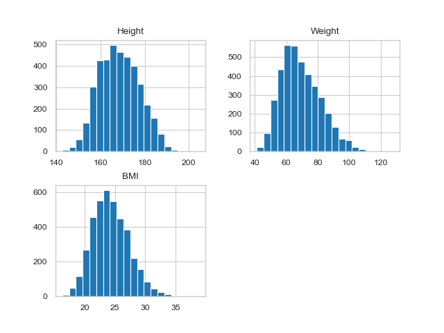

# Descriptive Statistics of Anthropometric Data

## Project Overview
This project explores different aspects of descriptive statistics on a dataset of [anthropometric measurements collected in a 1988 U.S. Army survey](http://mreed.umtri.umich.edu/mreed/downloads.html#ansur2). The dataset includes information on sex, height (cm), weight (kg), and BMI of individuals from the armed forces. The goal is to understand the data's central tendencies, variations, and distributions with the help of descriptive statistical summaries and visualizations. We also explored different variables such as numerical and categorical variables and their different combinations.
This readme contains only the short version of the summary and statistics that we explored in the notebook `descriptive_stats.ipynb`. For more exhustive analysis please refer to the notebook.

## Data Description
- **Sex**: Male or Female
- **Height**: Measured in centimeters
- **Weight**: Measured in kilograms
- **BMI**: Calculated as weight in kg divided by height in meters squared

The sample data looks like following:
| Index | Sex    | Height (cm) | Weight (kg) | BMI       |
|-------|--------|-------------|-------------|-----------|
| 1659  | Male   | 180.7       | 79.3        | 24.286050 |
| 1762  | Male   | 177.8       | 69.0        | 21.826574 |
| 3151  | Female | 160.7       | 60.4        | 23.388652 |
| 3626  | Female | 161.2       | 57.3        | 22.050810 |
| 3088  | Female | 150.7       | 49.2        | 21.663998 |
| 295   | Male   | 177.5       | 91.3        | 28.978377 |
| 1667  | Male   | 176.3       | 90.8        | 29.213341 |
| 818   | Male   | 165.5       | 61.9        | 22.599283 |
| 3229  | Female | 163.3       | 58.2        | 21.824817 |
| 178   | Male   | 185.3       | 83.5        | 24.318436 |

## Methods and Analysis

Some new columsn were added to the dataset to analyze these features more practically and meaningfully. Such as height type.

1. **Measures of Central Tendency**: Summary statistics were calculated using the `.describe()` method.
   - Key metrics include mean, standard deviation, min, max, and quartiles for height, weight, and BMI.

2. **Visualization**:
   - Histograms, box plots, and scatter plots were used to visualize distributions and relationships between variables.

   ### Histograms
    These histograms provide an overview of the distribution of height, weight, and BMI across the population.
   - **Height Histogram**: Shows the frequency of different height ranges in the dataset.

   - **Weight Histogram**: Provides the weight distribution across individuals. 
  

   - **BMI Histogram**: Shows the distribution of BMI values, highlighting the most common BMI categories.
   
   
   
   The above histogram shows the distribution of height, weight, and BMI across the population by using the histogram functions. In our analysis, we can see that they look somewhat normally distributed, wherease Weight seems little bit more skewed. When we look at the distribution based on the Sex, they seem to get slightly more symmetric.

   ### Box Plots
   Box plots are helpful in showing the overall distribution, some outliers and understanding the spread of data.
   - **Height Box Plot**: This plot highlights the median height, interquartile range, and any outliers at the extremes. A narrow range  indicate a relatively uniform height distribution, which is the case of Average Height and that is expected.

   ### Scatter Plots and Line Plots
   Scatter plots show relationships between height, weight, and BMI.
   - **Height vs. Weight**: A positive correlation is expected, where taller individuals often weigh more. Clusters may indicate gender differences or subgroups within the data.
    

    The above scatter plot shows the relationship between height and weight. We can see that they have a positive correlation, where as the height increases, the weight also increases, which is generally expected.

    The more wiser use of line plot was done to show the positive correlation between height and weight among two different sexes.
    

## Results and Key Insights
- **Descriptive Statistics**:
  - **Height**: The average height was around 168.57 cm with a standard deviation of 9.04 cm.
  - **Weight**: The average weight was 69.35 kg, with significant variability.
  - **BMI**: The mean BMI was 24.26, close to the upper end of the 'Normal' weight classification.

- **Some Insights**:
  - **Histograms**: Most data points fall within the expected normal ranges for height, weight, and BMI, with skewness in BMI towards overweight, indicating a larger proportion in this category.
  - **Box Plots**: The plots show a few outliers along with the spread of data. We checked it for height categories.
  - **Scatter Plots**: Height and weight have a positive correlation, where as the height increases, the weight also increases. This was also validated by the corrolation metrics which was 0.74.

## Conclusions
The dataset represents variety of data points with different height, weight and BMI. With the help of the descriptive statistics its easier to interepret the data, draw some insights and communicate the results.

---
